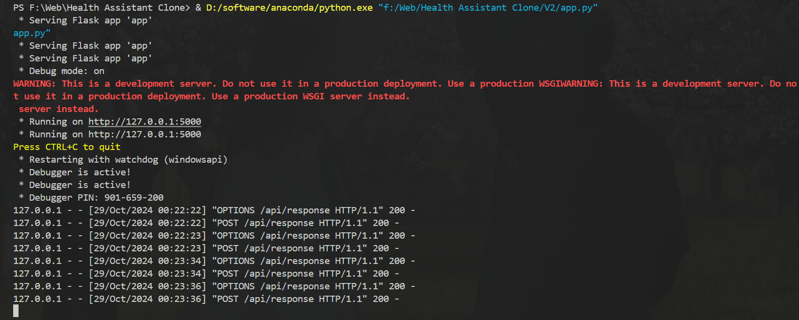
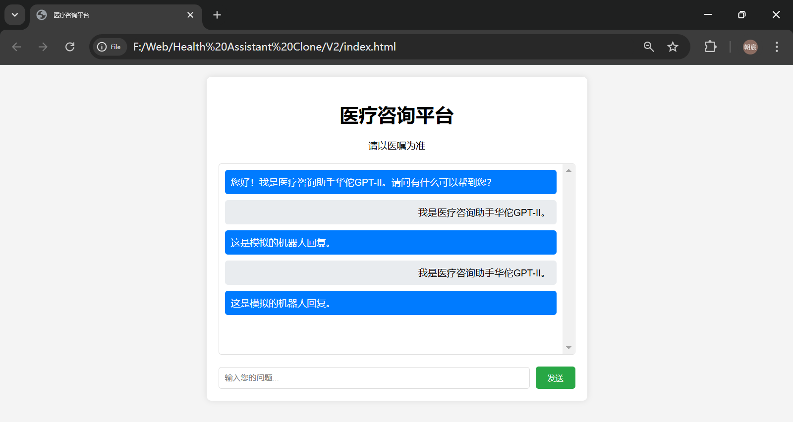

# HealthAssistantClone
## V2版本更新
### 1. 添加了app.py，用于启动服务，开放默认的 *http://127.0.0.1:5000* 端口

#### USAGE
1. 安装Flask和flask-cors包
```BASH
pip install Flask flask-cors
```
2. 启动服务
```BASH
python app.py
```
### 2. 相应的维护了cyy分支里面的代码，现在已经是可用状态
  </br>
    </br>
      </br>

  
## V1
### 1. **多轮对话功能**  
通过修改提示词，引导kimi输出合适的网页

对话框可以上下拖动查看历史记录
按下回车键可以快捷发送消息  

### 2. **后端接口**  
可以在代码末端更新JavaScript函数以实现请求服务器的功能
```JavaScript
        function simulateBotResponse(message) {
            // 这里可以添加与后端API通信的代码，以获取真实的机器人回复
            // 目前只是模拟一个简单的回复
            const botResponse = "这是模拟的机器人回复。";
            setTimeout(() => {
                chatBox.innerHTML += `<div class="message bot-message">${botResponse}</div>`;
            }, 1000);
        }

        // 发送消息到服务器并获取回复
        function sendToServerAndGetResponse(message) {
            return fetch('/api/response', {
                method: 'POST',
                headers: {
                    'Content-Type': 'application/json'
                },
                body: JSON.stringify({ message: message })
            })
                .then(response => response.json())
                .then(data => data.reply);
        }
```

新的prompt怎么写的可以参考：
点击链接查看和 Kimi 智能助手的对话 https://kimi.moonshot.cn/share/csfg3p4rmee54ni2g1bg
